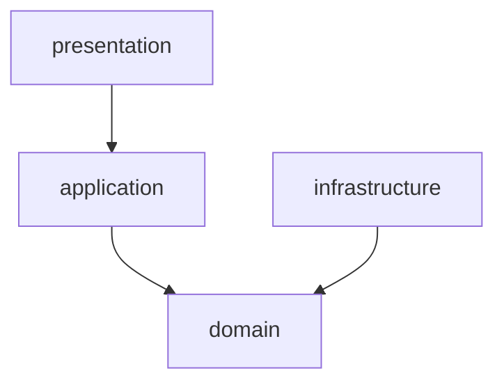
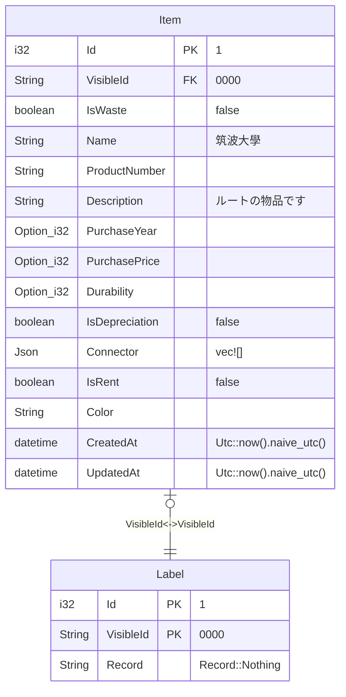
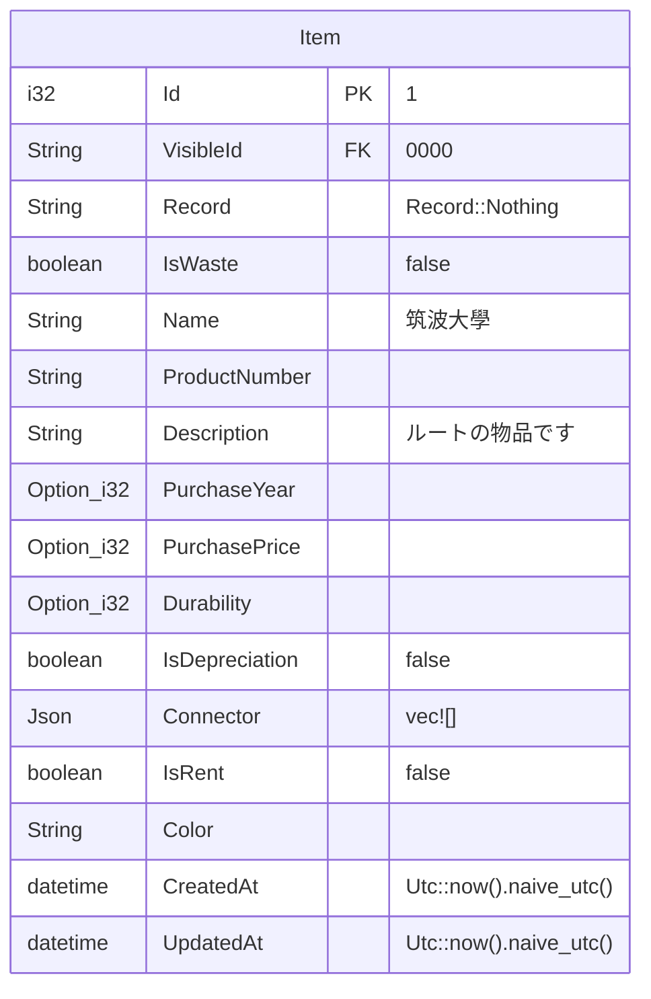
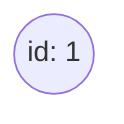

# Service and Container

## RDB (Container)

- PostgreSQL

## GraphDB (Container)

- Neo4j

## Meilisearch (Container)

- Meilisearch

## Object Strage (Service)

※ initilize のときのみ使用

- Cloudflare R2

# 構造

server では、Layered Architecture を採用している

※ SeaORM を採用している関係で構造が乱れているが、 SeaORM を使用する場合はこの構造のままの方が使いやすいので、この構造のままにしている



## presentation

- src/presentation 以下の binary crate

## application

- src/application 以下の library crate

## domain

- src/domain 以下の library crate

## infrastructure

- src/infrastructure 以下の library crate
- migration
- entity

# server の起動

```sh
cargo run --bin presentation
```

# migration の実行

```sh
DATABASE_URL="postgres://<username>:<password>@<ip_address>:<port>/<database_name>" sea-orm-cli migrate refresh
```

# initilizer の実行

```sh
cargo run --bin init
```

# 初期データ

## RDB



## Meilisearch



## GraphDB


