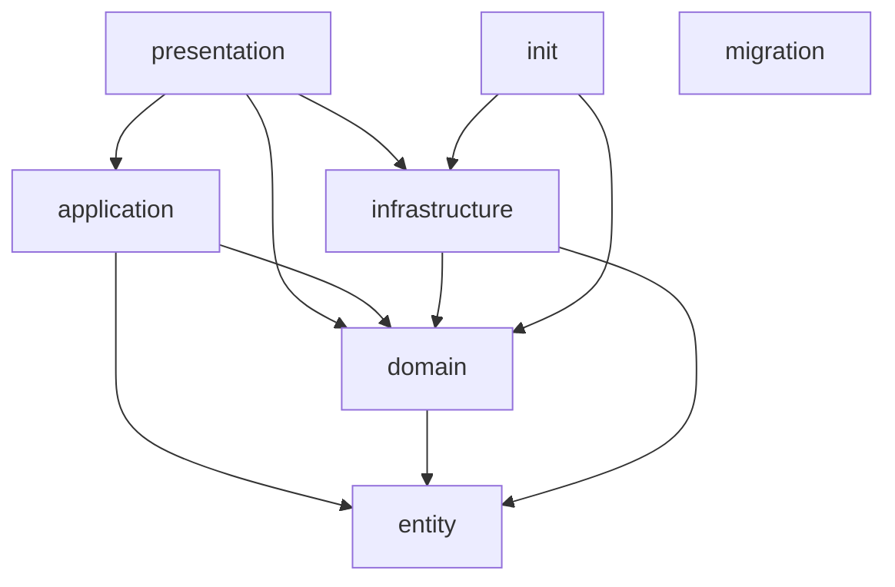
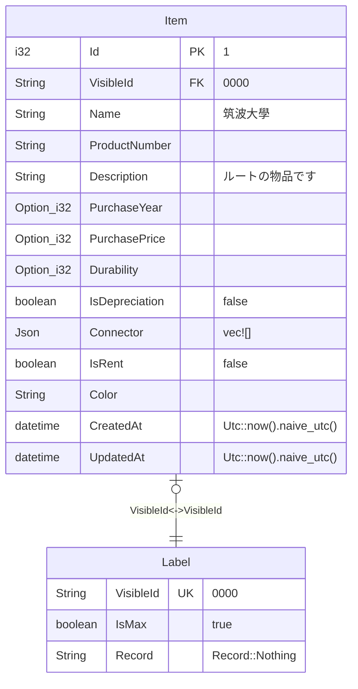
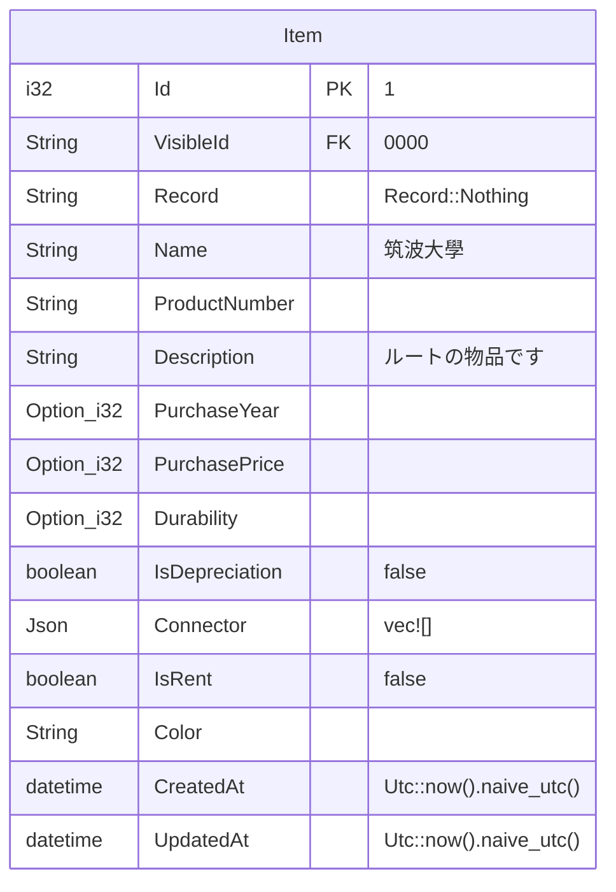
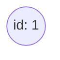

# Service and Container

## RDB (Container)

- PostgreSQL

## GraphDB (Container)

- Neo4j

## Meilisearch (Container)

- Meilisearch

## Object Strage (Service)

※ initilize のときのみ使用

- Cloudflare R2

# 構造

server では、Layered Architecture を採用している

※ SeaORM を採用している関係で構造が乱れているが、 SeaORM を使用する場合はこの構造のままの方が使いやすいので、この構造のままにしている



## presentation

- src/presentation 以下の binary crate

## application

- src/application 以下の library crate

## domain

- src/domain 以下の library crate

## infrastructure

- src/infrastructure 以下の library crate
- migration
- entity

# 開発環境

## 開発環境の構築

```sh
docker-compose -f dev.compose.yaml up -d
```

## server の起動

```sh
cargo run --bin presentation
```

## 開発環境の削除

```sh
docker-compose -f dev.compose.yaml down --rmi all --volumes
sudo rm -rf postgres neo4j meilisearch
```

# 製品版の環境

## 製品版の環境の構築

```sh
docker-compose -f prod.compose.yaml up -d
```

# 初期データ

## RDB



## Meilisearch



## GraphDB


